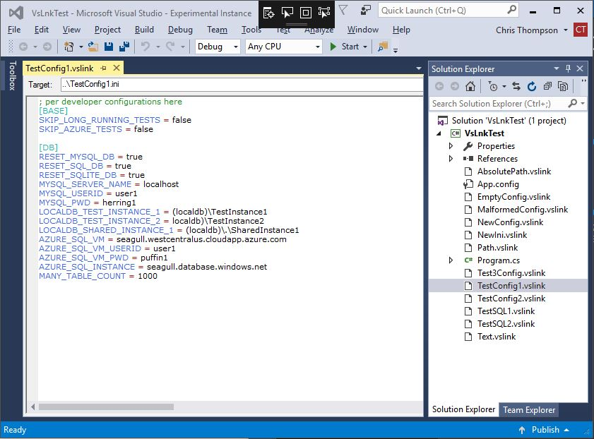
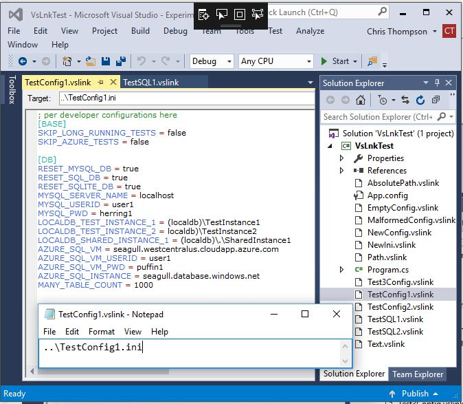

# VSLink
VSLink is a Visual Studio 2015 extension for linked files.

<a href="https://marketplace.visualstudio.com/items?itemName=christhompsongo.VSLink">VSLink in Visual Studio Gallery</a>

Didn't update this for Visual Studio 2017 because git support in Visual Studio 2017 provides the experience I was looking for.

